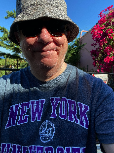

Moses Boudourides is in the Faculty of [Northwestern University School of Professional Studies (SPS) Data Science Program](https://sps.northwestern.edu/masters/data-science/faculty.php) and Affiliated Faculty at the [Science of Networks in Communities (SONIC) at Northwestern University](http://sonic.northwestern.edu/people/affiliated-faculty/moses-boudourides/). During 2019-20 he was Visiting Professor at the [New York University Abu Dhabi (NYUAD)](https://nyuad.nyu.edu/en/).

His undergraduate studies (Engineering Diploma) were on Chemical Engineering at the National Technical University of Athens (Greece) and his graduate studies (PhD) on Mechanics and Applied Mathematics at the Johns Hopkins University.

In 2019 he was awarded a Robert K. Merton Visiting Research Fellowship from the Institute for Analytical Sociology (IAS) at Linköping University in Sweden.

[Moses Boudourides at NYUAD](https://nyuad.nyu.edu/en/academics/divisions/science/faculty/moses-boudourides.html).

[Moses Boudourides at SONIC](http://sonic.northwestern.edu/people/affiliated-faculty/moses-boudourides/).

[Moses Boudourides CV](https://www.dropbox.com/s/otaqmlaix7w7wap/Boudourides_CV_Aug2020a.pdf?dl=0).
